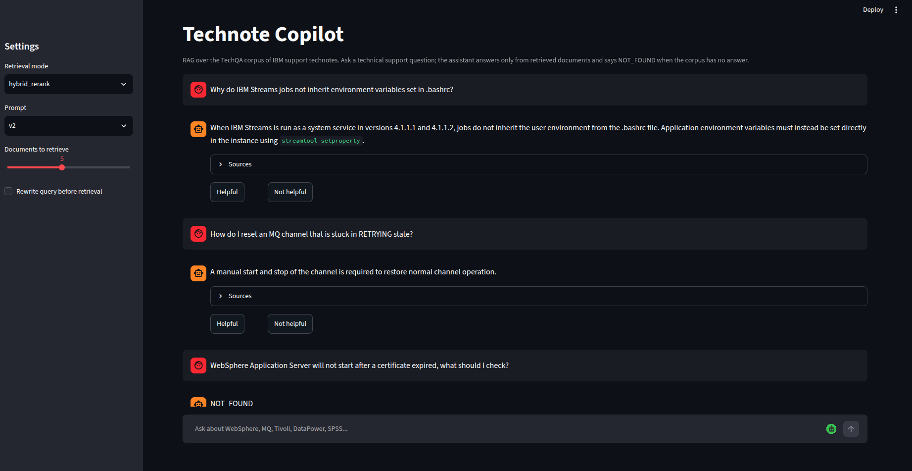
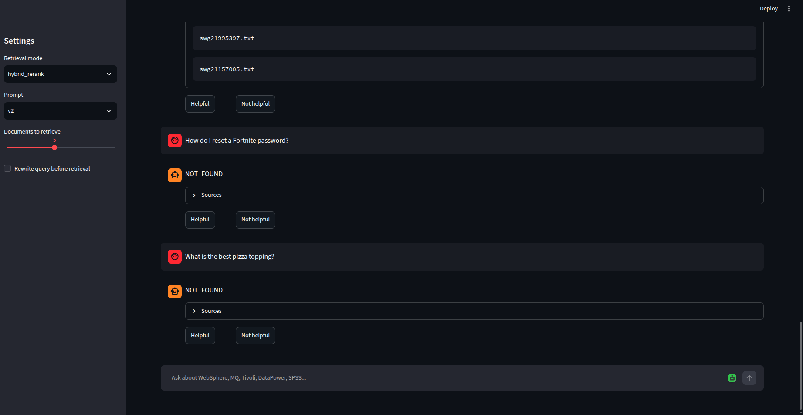
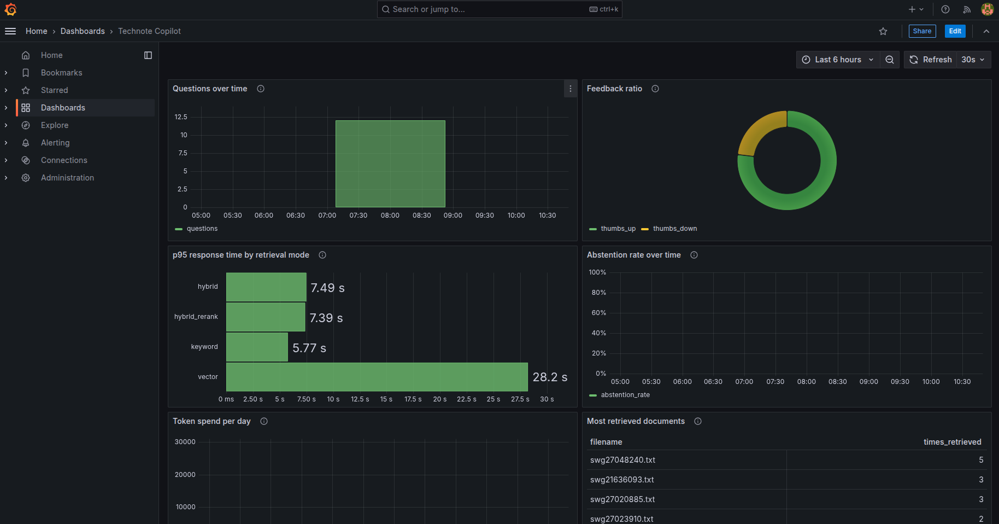

# Technote Copilot

A RAG application that answers IT support questions from a corpus of IBM
technotes, and admits when it can't. Built for the LLM Zoomcamp final
project.

## The problem

Tier 1 support work is mostly recognition: someone has almost certainly hit
this error before, and the fix is written down somewhere. The bottleneck is
finding it. Keyword search over a knowledge base fails when the user
describes symptoms ("scheduled reports fail after changing password") and
the document describes causes ("trusted credential renewal").

This project retrieves relevant technotes for a natural-language question
and generates a grounded answer with sources. The part I care most about:
support corpora never cover everything, and a confident wrong answer costs
an engineer more time than no answer. So the system is built and measured
around abstention. When the corpus doesn't contain the fix, the correct
output is `NOT_FOUND`, and the evaluation quantifies how often the model
holds that line.

## The data

[nvidia/TechQA-RAG-Eval](https://huggingface.co/datasets/nvidia/TechQA-RAG-Eval)
(Apache-2.0), a 910-question reduction of IBM's TechQA dataset built for
evaluating RAG systems. Questions are real posts from IBM developer forums,
messy formatting and embedded log output included. Each answerable question
carries its gold technote(s) in a `contexts` field.

Two properties shape the whole design:

1. There is no separate corpus file. The knowledge base is the union of all
   `contexts`, deduplicated by filename, which comes to 496 technotes and
   2023 chunks. That means most documents in the index are the gold answer
   to something, so
   retrieval scores here will read higher than they would against the
   original TechQA's 800k-technote haystack. I state this openly rather
   than let the numbers flatter the system.
2. A third of the questions (300 of 910) are labelled `is_impossible`:
   real questions the corpus cannot answer. They ship with no gold document and
   no reference answer. These become a hallucination benchmark for free,
   with human-made ground truth instead of LLM-generated labels.

## Architecture

```
                        ┌──────────────┐
  question ───────────▶ │  Streamlit    │ ◀── thumbs up/down
                        │  (app/ui.py)  │
                        └──────┬───────┘
                               │
                        ┌──────▼───────┐        ┌────────────┐
                        │  app/rag.py   │───────▶│  LLM (any   │
                        │  rewrite +    │        │  OpenAI-    │
                        │  retrieve +   │        │  compatible │
                        │  rerank +     │        │  endpoint)  │
                        │  prompt       │        └────────────┘
                        └──┬───────┬───┘
                           │       │
                 ┌─────────▼──┐  ┌─▼──────────┐
                 │  Qdrant     │  │  Postgres  │◀── Grafana
                 │  dense+BM25 │  │  logs +    │    dashboard
                 └────────────┘  │  feedback  │
                                 └────────────┘
```

One Qdrant collection holds both a dense vector (`BAAI/bge-small-en-v1.5`
via fastembed, CPU-friendly) and a BM25 sparse vector per chunk, which
gives four retrieval modes from a single index: keyword, vector, hybrid
with reciprocal rank fusion, and hybrid_rerank, which widens the hybrid
search to 20 candidate chunks and rescores each (question, chunk) pair
with a cross-encoder (`Xenova/ms-marco-MiniLM-L-6-v2`, also fastembed)
before keeping the top few.

Retrieval can optionally be preceded by query rewriting: one cheap LLM
call reformulates the question into the technical vocabulary of a
knowledge base, and only the retrieval step sees the rewritten text. The
answer prompt and the logged conversation keep the user's original
wording. It is a sidebar toggle in the UI, off by default, and falls back
to the original question if the rewrite call fails.

## Running it

Requirements: Docker with compose, and an API key for any OpenAI-compatible
LLM endpoint (OpenAI, Groq, or local Ollama).

```bash
git clone <this repo>
cd technote-copilot
cp .env.example .env        # set OPENAI_API_KEY, optionally OPENAI_BASE_URL

docker compose up -d --build      # qdrant, postgres, grafana, app
docker compose run --rm ingest    # download dataset, chunk, embed, index
```

Then open http://localhost:8501 for the app and http://localhost:3000 for
Grafana. Postgres is published on host port 5433 so it does not clash with
a locally installed Postgres; inside the compose network it is still 5432. Ingestion downloads the dataset from Hugging Face and embeds
~2-3k chunks on CPU; expect a few minutes on first run.

Without Docker: `pip install -r requirements.txt`, start Qdrant and
Postgres however you like, set the env vars from `.env.example`, then run
the same scripts directly.

### The interface



Answers are generated only from retrieved chunks, and every turn carries a
thumbs rating that lands in Postgres for the monitoring dashboard. The
sidebar switches retrieval mode and prompt variant at runtime, so all four
modes and both prompts are reachable without a restart; the shot above is
mid-comparison on `hybrid_rerank` and `v2` rather than the shipped defaults
of `hybrid` and `v1`.



The Sources expander lists the technote filenames behind each answer. Below
it are the two off-domain questions, both answered with exactly `NOT_FOUND`.
That is the behaviour the whole project is built around: the corpus does not
cover Fortnite or pizza, so the correct output is a refusal rather than a
plausible-sounding guess.

## Evaluation

The `make` targets below are convenience wrappers. If you do not have make
installed, every one of them has a plain docker compose equivalent shown
underneath.

Build the eval sets first (writes `data/eval_answerable.jsonl` and
`data/eval_impossible.jsonl`):

```bash
make eval-sets
docker compose run --rm --no-deps ingest python evals/build_eval_set.py
```

### Retrieval

```bash
make eval-retrieval
docker compose run --rm ingest python evals/eval_retrieval.py
```

Compares keyword, vector, hybrid, and hybrid_rerank on document-level hit
rate and MRR over all answerable questions. Adding `--rewrite` re-runs
whichever mode scored best with query rewriting enabled and appends one
extra row labelled `<mode>+rw`, so the cost of the rewrite call is visible
against the mode it has to beat. Results:

| mode | hit rate@5 | MRR@5 | n |
|---|---|---|---|
| keyword | 0.892 | 0.802 | 610 |
| vector | 0.918 | 0.824 | 610 |
| **hybrid** | **0.938** | **0.858** | 610 |
| hybrid_rerank | 0.913 | 0.823 | 610 |

**`hybrid` ships as the default.** It wins on both metrics, and the ordering
is what the design predicted for everything except the reranker: BM25 alone
is weakest, dense embeddings beat it, and fusing the two beats either.

Reranking made things worse, not better. `hybrid_rerank` scored below plain
`hybrid` on both measures despite starting from a wider candidate pool, and
the likely reason is a mismatch between the chunks and the cross-encoder.
`Xenova/ms-marco-MiniLM-L-6-v2` takes 512 tokens, while an 1800-character
chunk is roughly 450 tokens before the question is prepended, so the tail of
each candidate is truncated before scoring. MS MARCO also trains on short
web passages, and technote chunks carrying headers, stack traces and log
output sit well outside that distribution. The model reorders confidently on
input it cannot fully see, and some gold chunks get pushed down.

The mode stays in the codebase because the comparison is the point: it is
selectable in the UI and it keeps its row in this table. Making it
competitive would mean shrinking chunks to fit the cross-encoder window, or
picking a reranker with a longer context, and that is a chunking change
rather than a reranking change.

### LLM output

```bash
make eval-llm
docker compose run --rm ingest python evals/eval_llm.py --sample 100
```

Two measurements, run for every prompt variant in `app/rag.py`:

1. Relevance on a sample of answerable questions, scored by an LLM judge
   against the dataset's reference answers. Judged rather than
   string-matched because the reference answers are uneven; some are full
   procedures, some are a product name.
2. Abstention on the impossible questions. Every confident answer to an
   unanswerable question is a hallucination by construction. The
   hallucination rate is the headline number of this project.

Measured with `deepseek-v4-flash` as the answering model and `hy4-preview`
as the judge, both through an OpenAI-compatible endpoint, 100 questions per
subset.

| prompt | relevant | partly | non-relevant | wrong abstain | hallucination rate |
|---|---|---|---|---|---|
| **v1** | **0.54** | 0.11 | 0.00 | **0.35** | **0.12** |
| v2 | 0.25 | 0.04 | 0.00 | 0.71 | 0.13 |

**`v1` ships as the default.** v2 was written to trade a little coverage for
fewer hallucinations by insisting the context answer the question *fully*.
It did not buy that trade. The hallucination rate is flat between the two
(0.12 against 0.13, well inside sampling noise at n=100), while wrong
abstentions doubled from 0.35 to 0.71. v2 refuses on more than twice as many
questions the corpus can actually answer, for no measurable safety gain.

Both prompts score 0.00 non-relevant: on this corpus, when the system
answers at all, the judge never found the answer wrong. The failure mode is
over-caution rather than fabrication, which is the direction the problem
statement argued for. But v1 still abstains on 35% of answerable questions,
which is high against a retrieval hit rate of 0.938, and the two numbers are
not measuring the same thing. The retrieval eval over-retrieves 15 chunks
and scores the top 5 unique *documents*, whereas `answer()` passes 5
*chunks* to the model, which can come from only one or two documents. The
generator therefore sees a narrower slice of the corpus than the hit rate
suggests, and raising the chunk limit is the first thing to try against that
35%.

## Monitoring

Every Q&A round trip is logged to Postgres (mode, prompt version, latency,
token counts, sources, whether the model abstained), and the UI collects
thumbs up/down per answer.

Grafana is provisioned against the same database, dashboard and datasource
both, so the "Technote Copilot" dashboard is there on first load at
http://localhost:3000 with no import step. Its six panels are questions over
time, feedback ratio, p95 response time by retrieval mode, abstention rate
over time, token spend per day, and most retrieved documents. The panel SQL
is kept in [monitoring/queries.md](monitoring/queries.md) alongside the
dashboard JSON. Panels stay empty until the app has answered a few
questions, since they read the live logging tables.



The p95 panel is worth a second look. `vector` sits at 28.2 seconds against
roughly 7 seconds for the other three modes, and that is not a retrieval
problem: it is the one question asked with query rewriting enabled, paying
for an extra LLM call before the search. The dashboard surfacing that cost
without being asked is the point of having it.

## Project layout

```
app/        config, retrieval + generation, Postgres layer, Streamlit UI
ingest/     corpus build + Qdrant indexing (fully scripted, idempotent)
evals/      eval set builder, retrieval eval, LLM eval
monitoring/ grafana provisioning + panel SQL
data/       generated artifacts (gitignored)
```

## Rubric self-assessment

| criterion | status |
|---|---|
| Problem description | described above |
| Retrieval flow | knowledge base (Qdrant) + LLM |
| Retrieval evaluation | 4 modes compared over 610 questions, hybrid ships |
| LLM evaluation | 2 prompts compared on relevance and hallucination, v1 ships |
| Interface | Streamlit UI |
| Ingestion pipeline | scripted and idempotent (`ingest/ingest.py`) |
| Monitoring | thumbs feedback + provisioned Grafana dashboard, 6 panels |
| Containerization | everything in docker-compose |
| Reproducibility | pinned deps, public dataset, quickstart above |
| Hybrid search | evaluated and available as a mode |
| Document re-ranking | cross-encoder rescoring as the `hybrid_rerank` mode |
| Query rewriting | `--rewrite` flag and UI toggle, falls back on failure |


